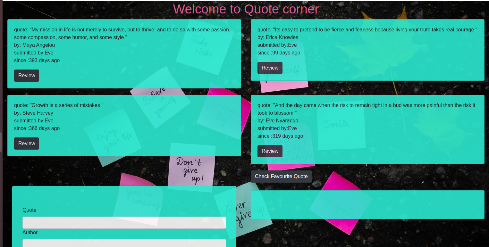

# Quotes

This project was generated with [Angular CLI](https://github.com/angular/angular-cli) version 10.2.0.

## Author
Eve Nyarang'o

## Description
This projects provides a platform where you can view quotes; add quote; Like, dislike and delete quotes; And check favourite quote.

## Project image

## BDD
Enter quote
Enter Author
Enter submit name
Enter submit date

## Installation Requirement
Run `ng serve` for a dev server. Navigate to `http://localhost:4200/`. The app will automatically reload if you change any of the source files.

## Code scaffolding

Run `ng generate component component-name` to generate a new component. You can also use `ng generate directive|pipe|service|class|guard|interface|enum|module`.

## Build

Run `ng build` to build the project. The build artifacts will be stored in the `dist/` directory. Use the `--prod` flag for a production build.

## Technologies used
This page was created using HTML, Angular CLI, BOOTSTRAP and CSS.

## Link
https://github.com/EveNyarango/Quotes

 ## Contact Information
 Email; evenyarango@gmail.com

 ## License and copyright
 MIT 

Copyright (C) **{Eve Nyarang'o}

## Further help

To get more help on the Angular CLI use `ng help` or go check out the [Angular CLI Overview and Command Reference](https://angular.io/cli) page.
